# 👋 Hi, I'm Ayushi Rai!

### 💻 B.Tech CSE Student | Aspiring Software Developer

 

---

  
<b>👩‍💻 About Me</b>

- 🎓 B.Tech Computer Science & Engineering Student
- 💻 Passionate about Software Development
- 🧠 Currently improving my DSA & Problem Solving skills
- 🌐 Learning Full Stack Development
- 🤖 Exploring AI & Machine Learning
- 🚀 Love building real-world projects
- 🌱 Always Learning & Growing
  

---

<b>🛠️ Technical Skills</b>

<table>
<tr>
<th>Category</th>
<th>Skills</th>
</tr>

<tr>
<td><b>Languages</b></td>
<td>

</td>
</tr>

<tr>
<td><b>Frameworks</b></td>
<td>

</td>
</tr>

<tr>
<td><b>Database</b></td>
<td>

</td>
</tr>

<tr>
<td><b>AI & ML</b></td>
<td>

</td>
</tr>

<tr>
<td><b>Version Control</b></td>
<td>

</td>
</tr>

<tr>
<td><b>IDE & Environment</b></td>
<td>

</td>
</tr>

</table>

---
<h3>📊 GitHub Stats</h3>

  
  

---

<h3>🔥 GitHub Streak</h3>

---

# 🤝 Connect With Me

---

### 🌱 Learn • Build • Improve • Repeat 🚀

